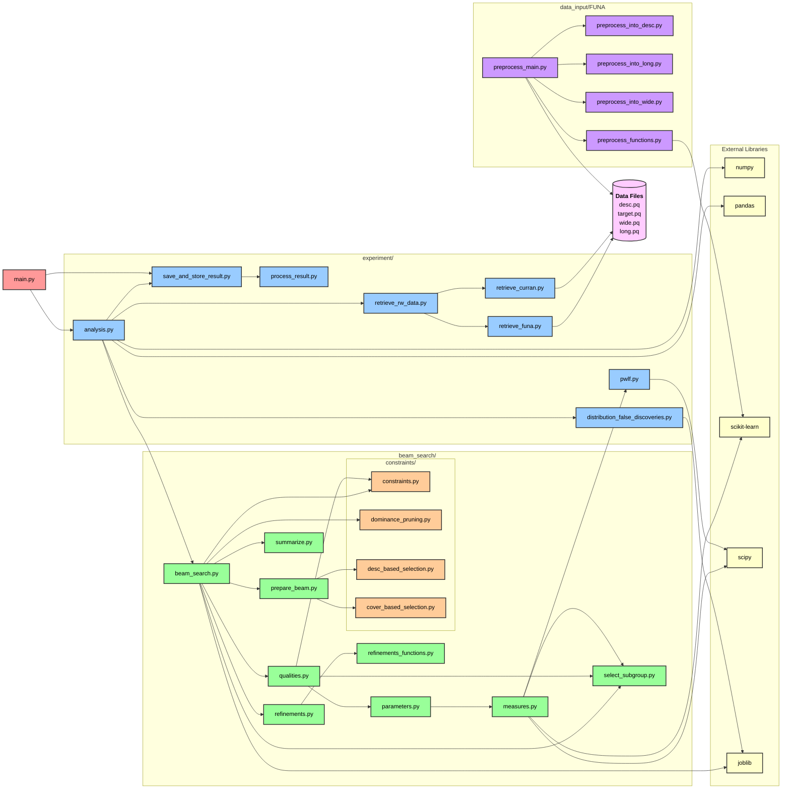

# Defining graph

- Estrutura Principal:
  1. `main.py` - Ponto de entrada principal do aplicativo
  2. Módulos de Experimento (azul) - Responsáveis por análise, recuperação de dados e processamento de resultados
  3. Módulos de Beam Search (verde) - Implementam o algoritmo de busca em feixe para descoberta de padrões
  4. Módulos de Constraints (laranja) - Aplicam restrições e filtros
  5. Módulos de Preprocessamento (roxo) - Processam dados de entrada
  6. Bibliotecas Externas (amarelo claro) - numpy, pandas, scikit-learn, scipy, joblib
  7. Arquivos de Dados (rosa) - Arquivos parquet processados
- Fluxo de Dependências:
  - O `main.py` chama principalmente `analysis.py` e `save_and_store_result.py`
  - O módulo de análise coordena a recuperação de dados e execução do beam search
  - O beam search é o núcleo do algoritmo, usando vários módulos auxiliares para qualidades, refinamentos, parâmetros e medidas
  - Os constraints aplicam filtros e pruning durante o processo
  - Os dados são preprocessados pelos módulos FUNA e depois consumidos pelos módulos de experimento

## Parâmetros

A função `main_test_cases` permite selecionar diferentes cenários de execução para a função central `main`, que é responsável por executar análises em um conjunto de dados. A principal diferença entre cada caso de teste reside nos parâmetros passados para a função `main`, especialmente nos dicionários `sim_params` (parâmetros de simulação) e `extra_info` (informações adicionais).

A função `main` cria um diretório de saída e um arquivo de saída vazio para os resultados. Se `synthetic_params` for `None`, ela executa a análise de dados, caso contrário, uma análise sintética (embora esta última opção seja comentada com "It never occurs", indicando que não é utilizada atualmente). No final, o arquivo de resultados é atualizado.

Todos os casos de teste utilizam as seguintes configurações comuns:

- `output_path`: 'output/DescriptiveLearning'
- `current_date`: '20250630'
- `input_data_path`: 'data_input'
- Parâmetros de simulação comuns: `'b':`, `'w':`, `'dbs': [False]`, `'wcs': [True]`, `'dp': [False]`, `'md': ['without']`, `'min_size': [0.05]`.
- Informações extras comuns: `'case_based_target': False`, `'run_beam_search': True`.
- `datasets_names`: Sempre `['desc']` em todos os casos de teste.

A tabela abaixo compara as **diferenças chave** entre cada um dos casos de teste, destacando os parâmetros que variam:

| Caso de Teste | `data_name` | `sim_params['model']`                                            | `sim_params['d']` | `sim_params['q']` | `sim_params['gamma']` | `sim_params['alpha']` | `target_column_names`                     | `sample` | `sample_prop` | `run_redun_metrics` | `make_dfd` | `m`  | `startorder` | `maxorder` | `prefclass` |
| :------------ | :---------- | :--------------------------------------------------------------- | ----------------: | ----------------: | :-------------------- | :-------------------- | :---------------------------------------- | :------- | :------------ | :------------------ | :--------- | :--- | :----------- | :--------- | :---------- |
| `choice_1a`   | FUNA        | ['subrange_ll', 'subrange_ssr', 'subrange_ssrb']                 |                   |              [10] | [0.1, 0.5, 0.9]       | N/A                   | ['DMTime', 'IDCode', 'PreOrd', 'DMStimL'] | True     | 0.05          | True                | False      | None | N/A          | N/A        | N/A         |
| `choice_1b`   | FUNA        | ['subrange_ll', 'subrange_ssr', 'subrange_ssrb', 'subrange_fit'] |                   |              [10] | [0.1, 0.5, 0.9]       | N/A                   | ['DMTime', 'IDCode', 'PreOrd', 'DMStimL'] | True     | 0.05          | False               | True       | 50   | N/A          | N/A        | N/A         |
| `choice_1c`   | FUNA        | ['subrange_ssrb']                                                |                   |              [20] | [0.5]                 | N/A                   | ['DMTime', 'IDCode', 'PreOrd', 'DMStimL'] | False    | None          | False               | False      | None | N/A          | N/A        | N/A         |
| `choice_2a`   | FUNA        | ['subrange_bic']                                                 |               [5] |              [10] | [0.5, 0.9]            | N/A                   | ['DMTime', 'IDCode', 'PreOrd', 'DMStimL'] | True     | 0.05          | True                | True       | 2    | 0            | 3          | N/A         |
| `choice_2b`   | FUNA        | ['subrange_ssr']                                                 |            [3, 5] |              [10] | [0.1, 0.5, 0.9]       | N/A                   | ['DMTime', 'IDCode', 'PreOrd', 'DMStimL'] | True     | 0.05          | True                | True       | 50   | N/A          | N/A        | N/A         |
| `choice_2c`   | Curran      | ['reg_ssr', 'reg_ssrb', 'reg_bic']                               |            [3, 5] |              [10] | [0.1, 0.5, 0.9]       | [0.05]                | ['read', 'id', 'occasion', 'kidagetv']    | None     | N/A           | True                | True       | 2    | 0            | 3          | None        |
| `choice_2d`   | FUNA        | ['subrange_bic']                                                 |               [3] |              [20] | [0.5]                 | N/A                   | ['DMTime', 'IDCode', 'PreOrd', 'DMStimL'] | False    | 0.05          | False               | False      | 2    | 0            | 3          | N/A         |
| `choice_3`    | Curran      | ['reg_ssr', 'reg_ssrb', 'reg_bic']                               |            [3, 5] |              [10] | [0.1, 0.5, 0.9]       | [0.05]                | ['read', 'id', 'occasion', 'kidagetv']    | None     | N/A           | False               | True       | 50   | 0            | 3          | None        |
| `choice_4`    | FUNA        | ['subrange_bic']                                                 |            [3, 5] |              [10] | [0.1, 0.5, 0.9]       | N/A                   | ['DMTime', 'IDCode', 'PreOrd', 'DMStimL'] | True     | 0.05          | False               | True       | 50   | 0            | 3          | N/A         |

**Observações Adicionais sobre as Diferenças:**

- **Conjunto de Dados (`data_name`)**: A maioria dos casos de teste utiliza o conjunto de dados **'FUNA'**, com exceção de `choice_2c` e `choice_3`, que utilizam o conjunto de dados **'Curran'**.
- **Modelos de Simulação (`sim_params['model']`)**:
  - Casos 'FUNA' utilizam modelos com o prefixo 'subrange\_' (e.g., 'subrange_ll', 'subrange_ssr', 'subrange_ssrb', 'subrange_fit', 'subrange_bic').
  - Casos 'Curran' utilizam modelos com o prefixo 'reg\_' (e.g., 'reg_ssr', 'reg_ssrb', 'reg_bic').
- **Parâmetros `d` e `q`**: Variam para testar diferentes profundidades de hierarquia (`d`) e quantidade de grupos (`q`) para os modelos.
- **Valores de `gamma`**: A maioria dos casos testa múltiplos valores de `gamma` ([0.1, 0.5, 0.9]), enquanto `choice_1c` e `choice_2d` testam um único valor ([0.5]).
- **Parâmetro `alpha`**: É introduzido apenas para os modelos de regressão ('reg\_') nos casos de teste que usam o dataset 'Curran' (`choice_2c` e `choice_3`), com o valor `[0.05]`.
- **Nomes das Colunas Alvo (`target_column_names`)**: Mudam de `['DMTime', 'IDCode', 'PreOrd', 'DMStimL']` para 'FUNA' para `['read', 'id', 'occasion', 'kidagetv']` para 'Curran'.
- **Amostragem (`sample` e `sample_prop`)**:
  - Muitos casos utilizam amostragem (`sample: True`) com uma proporção de `0.05`.
  - `choice_1c` não usa amostragem (`sample: False`) e `sample_prop` é `None`.
  - `choice_2d` não usa amostragem (`sample: False`), mas `sample_prop` ainda é definido como `0.05`.
  - `choice_2c` e `choice_3` definem `sample` como `None` e não especificam `sample_prop`.
- **Métricas de Redundância (`run_redun_metrics`)**: Alguns casos executam as métricas de redundância (`True`), enquanto outros as desativam (`False`).
- **Criação de DFD (`make_dfd` e `m`)**: Alguns casos ativam a criação de um DFD (`True`) com diferentes valores de `m` (2 ou 50), enquanto outros não criam DFD (`False`) e `m` é `None`.
- **Parâmetros de Ordem (`startorder` e `maxorder`)**: Presentes nos casos `choice_2a`, `choice_2c`, `choice_2d`, `choice_3` e `choice_4`, com `startorder: 0` e `maxorder: 3`.
- **`prefclass`**: Este parâmetro é relevante e definido como `None` apenas nos casos que utilizam o dataset 'Curran' (`choice_2c` e `choice_3`).
- **Nota específica para `choice_2b`**: O código inclui um comentário indicando que esta escolha "do ssr again, with 1/ef instead of ef", sugerindo uma alteração interna na lógica de cálculo do SSR que não é visível diretamente nos parâmetros da função `main`.
